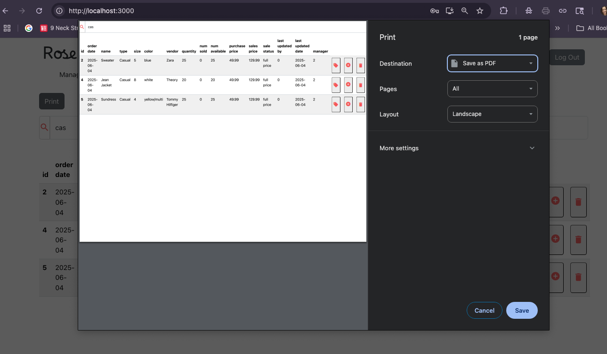
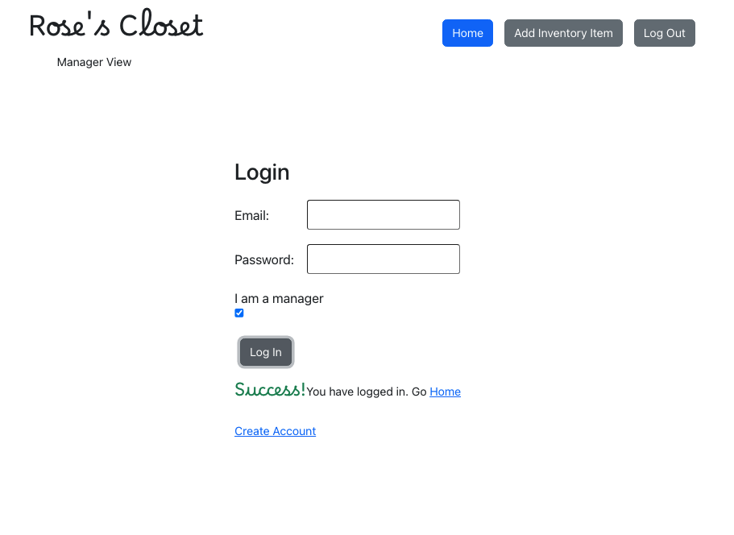
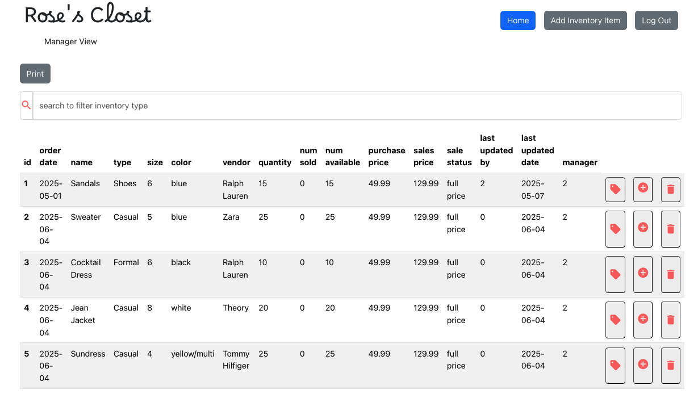

# Inventory Management App
Inventory Management App was created as my capstone project/culmination of my BS SWE degree at Western Governor's University. It is configured to run with my [Spring Boot application](https://github.com/miShelbyT/springboot-web-app), deployed separately. It operates dual permissions for general users and admin (manager) users to handle and update current inventory details for any relatively small sales operation/business. The current deploy is for a boutique clothing store called Rose's Closet. 

Upon login, the general user can view the current inventory of the store, and can filter, run and print reports. (Print functionality is via the npm package: [react-to-print](https://www.npmjs.com/package/react-to-print).)

     

Upon login, the admin/manager user has full CRUD permissions for the inventory, including price and other status changes, as well as reducing inventory items and/or purchasing additional items.

     

     

The deployed application uses https protocol and JWT tokens for authentication and session management. More information about the Spring Boot application can be found [here](https://github.com/miShelbyT/springboot-web-app).

Deploy link available upon request - AWS invoices can add up!

*Note: this application  was initially created as a monorepo on my Gitlab account. Gitlab permissions made it difficult to untangle the application, so with a little help from a kind [friend](https://github.com/yibbidy) we got this decoupled so I could continue configuring my front-end and back-end repos to be deployed separately.*

## Getting Started with Create React App

This project was bootstrapped with [Create React App](https://github.com/facebook/create-react-app) - even though I understand that this has been deprecated. (Old habits die hard.)

